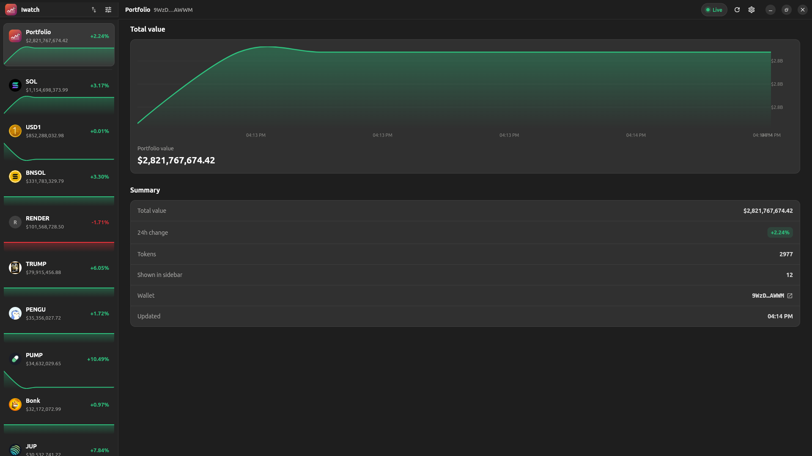

<p align="center">
  
</p>

<h1 align="center">Iwatch</h1>

A **native Ubuntu desktop app** (Flutter + [Yaru](https://pub.dev/packages/yaru)) for
watching a Solana wallet's tokens, holdings, and **total value in real time** as prices
move on-chain.

No webview, no Electron, no bundled Chromium — a true native GTK application that follows
the GNOME/Adwaita conventions you already know from **Settings**, **Files** and **Resources**.

 

<p align="center">
  
</p>

## Download

Grab the latest `.deb` from [**Releases**](https://github.com/papito0x1/Iwatch/releases/latest):

```bash
sudo apt install ./iwatch_1.0.0_amd64.deb
```

Then launch **Iwatch** from the app grid.

## Looks and feels native

Iwatch is built around the same **master–detail** layout as the Ubuntu *Resources* monitor:

- A **native Yaru title bar** with proper close / minimize / maximize controls, drawn by the
  app (the GTK header bar is hidden) and split across the sidebar and detail panes.
- A **sidebar** where the portfolio and each token is a tile with an icon, value and a
  **live sparkline** — just like CPU/Memory/GPU in Resources.
- A **detail pane** with section headers, a large area-chart card ("Value"), and a grouped
  **boxed list** of properties (price, 24h change, holdings, mint…).
- Ubuntu colours throughout: **Ubuntu Orange** accent, aubergine brand tone, Yaru-dark
  neutral surfaces, `YaruSwitch` / `YaruIconButton` / `YaruDialogTitleBar`.

## Features

- **Watch any wallet** — paste a Solana address; it's persisted and auto-loads on launch.
- **Live portfolio + per-token graphs** — value, price, 24h change and a sparkline that
  updates as prices move.
- **Manage the sidebar** — choose which tokens appear (hidden tokens still count toward the
  total); sort by value / 24h change / name.
- **Real on-chain data** — balances from Solana RPC; prices/metadata from Jupiter.
- **Smart polling** — prices refresh often (light), balances slowly (heavier RPC).
- **Custom RPC** — paste a Helius / QuickNode / Triton endpoint in Settings.

## Run it

Flutter (with Linux desktop support) and the GTK toolchain (`clang`, `cmake`, `ninja`,
`libgtk-3-dev`) must be installed.

```bash
flutter pub get
flutter run -d linux        # debug
flutter build linux         # release → build/linux/x64/release/bundle/iwatch
```

### Install desktop integration (dock icon + launcher)

```bash
flutter build linux
./tool/install-desktop.sh   # installs the Iwatch icon + .desktop launcher for your user
```

The app icon is generated by `tool/make_icon.py` (Pillow) — an Ubuntu orange→aubergine
squircle with a live rising-chart mark.

## How it works

| Concern | Source |
| --- | --- |
| SOL + SPL/Token-2022 balances | Solana JSON-RPC (`getBalance`, `getTokenAccountsByOwner`) |
| Live USD prices + 24h change | Jupiter `price/v3` |
| Token symbol / name / icon | Jupiter `tokens/v2/search` |

All network requests run directly from the Dart isolate — no CORS, no IPC bridge, no keys.

```
lib/
  main.dart               app entry, Yaru theme, window setup
  theme.dart              Ubuntu/Yaru palette
  models/models.dart      balance / price / meta / token-row models
  services/
    solana_service.dart   Solana RPC + Jupiter (port of the old Electron main.js)
  state/
    wallet_model.dart      ChangeNotifier: state, polling, persistence, sidebar order
  utils/format.dart       number / time formatters
  screens/
    home.dart             split header + master-detail layout
    welcome.dart          no-wallet entry screen
    detail_views.dart     portfolio + token detail panes
  widgets/                charts (fl_chart), sidebar tile, sections, dialogs, common UI
tool/
  make_icon.py            generates the app icon at all sizes
  install-desktop.sh      installs icon + .desktop launcher

legacy-electron/          the original Electron app, kept for reference
```

## Settings

- **Custom RPC endpoint** — the public RPC is rate-limited; a dedicated endpoint is recommended.
- **Price / balance refresh (s)** — polling cadence (defaults 12s / 90s).
- **Clear saved data** — wipes the saved wallet, sidebar layout, and chart history.

## Migrated from Electron

Originally an Electron + Chart.js app, rewritten as a native Flutter/Yaru application and
restyled to match Ubuntu's Resources monitor. The original sources live in
[`legacy-electron/`](legacy-electron/).
